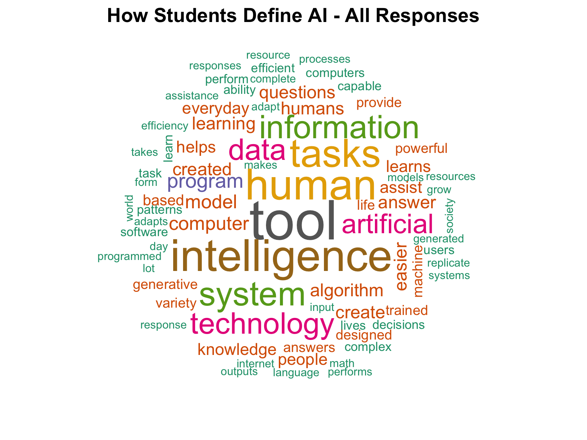

Welcome to the **DATA 117 Fall 2026 Cohort Snapshot**.

This site is a living picture of our class community: where we come from, how we define artificial intelligence, what inspires us, and the music we chose to represent ourselves.

Responses are collected through a Google Form and automatically transformed into visualizations, a musical taste map, an AI-definition word cloud, and a class playlist.

## Haven't filled it out yet?

[Take the DATA 117 survey](https://forms.gle/xYPbUmVaRbAJpqSh9){.btn .btn-primary}

## The cohort, by the numbers



## What's next

- [Music Map](taste-map.qmd) — where songs and one-sentence reflections land in music-text space.
- [Data](data.qmd) — the anonymized dataset and generated files.
- [Playlist](playlist.qmd) — the class playlist

<iframe data-testid="embed-iframe" style="border-radius:12px" src="https://open.spotify.com/embed/playlist/14pt4S2uBJe2xYB7PLCXmC?utm_source=generator&si=6885204e615f4d30" width="100%" height="352" frameBorder="0" allowfullscreen="" allow="autoplay; clipboard-write; encrypted-media; fullscreen; picture-in-picture" loading="lazy"></iframe>

