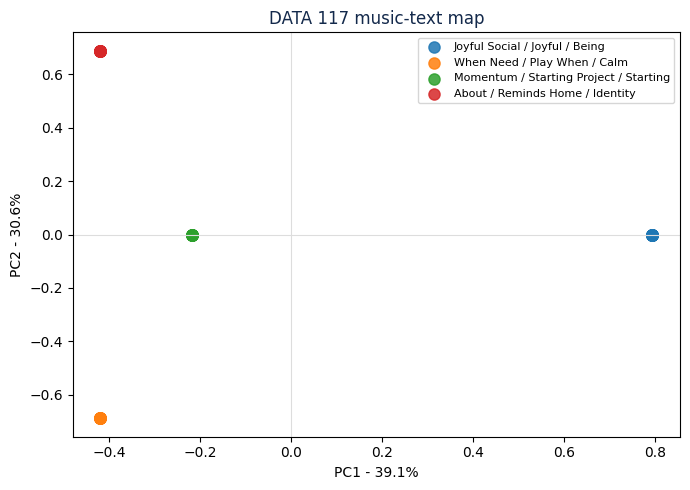
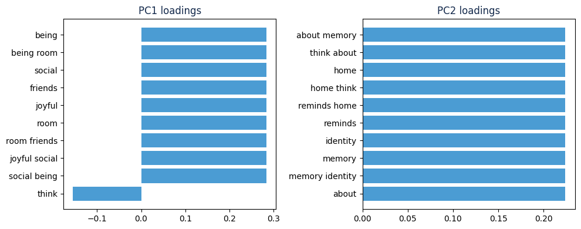

## The idea

Every person becomes a short document: the sentence they wrote about how their song makes them feel. The workflow turns those sentences into tf-idf vectors, projects them to two dimensions with PCA, and uses lightweight clustering to name taste neighborhoods.

Color shows the learned taste neighborhood. The map intentionally does **not** encode role or program because the DATA 117 survey does not collect that information.

## Interactive map

<iframe src="docs_assets/taste_map.html" width="100%" height="620" frameborder="0" title="Interactive taste map"></iframe>

## Static map

## Reading the axes



